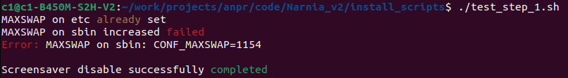
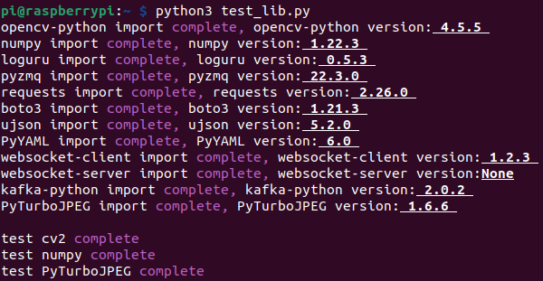

# Настройка "Raspberry Pi4 Model B" для проекта "ANPR"
## Апдейт от 15.11.22
Данная инструкция написана для пользователей ОС Linux, для других систем будет отличаться шаги подключения по SSH.

В процессе настройки я буду ссылаться следующие пункты:
- [Получение текущего ip - адреса](#ifconfig_result)
- [Подключение по протоколу SSH](#ssh_connect)
- [Подключение по протоколу SFTP](#sftp_connect)

Настройка состоит из следующих частей:
- [Установка системы](#install_system)
    - [Прошивка флеш-карты](#burn_image)
    - [Установка операционной системы](#install_os)
- [Работа с GitLab](#gitlab_work)
    - [Скачивание проекта](#download_project)
    - [Установка необходимых зависимостей](#install_dependences)
    - [Установка необходимых библиотек](#install_libs)
- [Конфигурация Swap и спящего режима](#swap_n_sleep_config)
    - [Настройка при помощи bash-скрипта](#bash_config)
    - [Ручная настройка](#handmade_config)
- [Настройка при помощи графического интерфейса](#gui_config)
    -  [Настройка GPU](#gpu_config)
- [Настройка при помощи "raspi-config"](#raspi_congig)
    - [Настройка интерфейсов взаимодействия (SSH, SFTP)](#ssh_enable)
    - [Отключение графического интерфейса](#gui_disable)
    - [Отключение функции "screen blanking"](#blanking_disable)
- [Проверка работы системы](#check_system)
- [Настройка crontab](#crontab_config)
- [Удаление документации и скриптов настройки](#delete_info)

<a name="ifconfig_result"></a>

### Получение текущего ip - адреса
Для того, чтобы получить актуальный ip - адрес, необходимо открыть на устройстве консоль ("Ctrl" + "Alt" + "t") и выполнить команду:
```sh
ifconfig
```

В самом верху вывода результата выполнения команды смотрим наш текущий IP - адрес


<a name="ssh_connect"></a>

### Подключение по протоколу SSH
Для того, чтобы подключиться к устройству по протоколу ```SSH``` необходимо открыть у себя на компьютере консоль ("Ctrl" + "Alt" + "t") и выполнить команду:
```sh
ssh $USERNAME@ip-address
Пример: ssh pi@192.168.32.254
```
Принимаем новый сертификат (если требуется) и вводим пароль от пользователя. 

<a name="sftp_connect"></a>

### Подключение по протоколу SFTP
Для доступа к файловой системе на удалённом устройстве с использованием графического интрефейса можно использовать подключение по протоколу ```SFTP```. Для этого необходимо открыть встроенный проводник (nautilus), перейти на вкладку "+ Другие места", в поле ввода, которое находится в нижней части окна прописать следующую команду:
```sh
sftp://$USERNAME@ip-address
Пример: sftp://pi@192.168.32.254
``` 
Принимаем новый сертификат (если требуется) и вводим пароль от пользователя. 


<a name="install_system"></a>

### 1. Установка системы

<a name="burn_image"></a>

#### 1.1. Прошивка флеш-карты
##### **Следует учесть, что максимальный объем карты памяти составляет 32 GB. Карта памяти, класс которой ниже 10 не имеет смысла ввиду низкой скорости передачи данных.**

Для прошивки флеш-карты необходимо скачать [**"Raspberry Pi Imager"**](https://www.raspberrypi.com/software/). После установки, в предоставленном выборе систем необходимо выбрать *Raspberry Pi OS (other)* ➞ *Raspberry Pi OS (64-bit)*.


После окончания прошивки образа на карту памяти, вставляем её в Raspberry, подключаем к Raspberry клавиатуру, экран, мышь (если экран не сенсорный), Ethernet-кабель, подаём питание. **Подавать питание надо после подключения экрана, иначе есть шанс того, что экран не заведётся.**

<a name="install_os"></a>

#### 1.2. Установка операционной системы
Просто следуем обычной установке системы, если есть вариант активировать протокол ```SSH```, то лучше это сделать, иначе советую первым же делом [настроить](#ssh_enable) этот протокол. 

<a name="gitlab_work"></a>

### 2. Работа с GitLab

<a name="download_project"></a>

#### 2.1. Скачивание проекта

При необходимости, выполняем [подключение по протоколу SSH](#ssh_connect).

Открываем консоль ("Ctrl" + "Alt" + "t") и выполняем следующие команды:
```sh
sudo apt-get install git
cd ~/Documents
git clone https://git.dclouds.ru/narnia/narnia-v2/cam_module.git Narnia_v2
cd Narnia_v2
git checkout prototype_test
sudo chmod 775 install_scripts/*.sh
```

<a name="install_dependences"></a>

#### 2.2. Установка необходимых зависимостей
При необходимости, выполняем [подключение по протоколу SSH](#ssh_connect).

Открываем консоль ("Ctrl" + "Alt" + "t") и выполняем следующие команды:
```sh
cd ~/Documents/Narnia_v2/install_scripts
sudo ./install_dependences.sh
```
Ждём окончания установки. Если по пути что-то сломалось, тогда гугл в помощь. К сожалению, я не могу предусмотреть всё.


<a name="install_libs"></a>

#### 2.3. Установка необходимых библиотек
При необходимости, выполняем [подключение по протоколу SSH](#ssh_connect).

Открываем консоль ("Ctrl" + "Alt" + "t") и выполняем следующие команды:
```sh
cd ~/Documents/Narnia_v2/install_scripts
./install_libs.sh
```
Ждём окончания установки. Если по пути что-то сломалось, тогда гугл в помощь. К сожалению, я не могу предусмотреть всё.

<a name="swap_n_sleep_config"></a>

### 3. Конфигурация swap и спящего режима 

<a name="bash_config"></a>

#### 3.1. Настройка при помощи bash-скрипта

Изначально на расбери установлен размер swap в 1 Гб, чего зачастую не хватает, по этой причине было принятно решение о расширении swap до 4 Гб. Также, для исключения блокировки расбери по таймауту, необходимо отключить спящий режим.

При необходимости, выполняем [подключение по протоколу SSH](#ssh_connect).

Открываем консоль ("Ctrl" + "Alt" + "t") и выполняем следующие команды:
```sh
cd ~/Documents/Narnia_v2/install_scripts
sudo ./swap_n_sleep.sh
```




После успешного выполнения скрипта, необходимо перезагрузить систему, чтобы изменения вступили в силу.

<a name="handmade_config"></a>

#### 3.2. Ручная настройка

В случае, если настройка с помощью скрипта выдаст ошибку, можно настроить вручную

При необходимости, выполняем [подключение по протоколу SSH](#ssh_connect).

Открываем консоль ("Ctrl" + "Alt" + "t") и выполняем следующие действия:
```sh
sudo nano /sbin/dphys-swapfile
```
Ищем глазами строку в которой есть упоминание о "CONF_MAXSWAP" и меняем руками то, что там написано на "CONF_MAXSWAP=4096".
```sh
sudo nano /etc/dphys-swapfile
```
Ищем глазами строку в которой есть упоминание о "CONF_MAXSWAP" и меняем руками то, что там написано на "CONF_MAXSWAP=4096".
```sh
sudo nano /etc/lightdm/lightdm.conf
```
В конец файла дописываем строку:
```sh
xserver-command=X -s 0 dpms
```
Не забываем перезагрузить устройство, чтобы изменения вступили в силу
```sh
sudo reboot now
```

<a name="gui_config"></a>

### 4. Настройка при помощи графического интерфейса

<a name="gpu_config"></a>

#### 4.1. Настройка GPU
Необходимо попасть в настройки, для этого нажимаем на иконку в верхнем левом углу и переходим "Preferences" ➞ "Raspberry Pi Configuration" ➞ "Performance". Выставляем значение в 128 Mb.

Если в процессе установки системы был активирован протокол "SSH", можно отключить все устройства ввода/вывода и далее работать через протокол ```SSH```.

<a name="raspi_congig"></a>

### 5. Настройка при помощи "raspi-config"

<a name="ssh_enable"></a>

#### 5.1. Настройка интерфейсов взаимодействия  (SSH, SFTP)
Открываем консоль ("Ctrl" + "Alt" + "t") и выполняем команду:
```sh
sudo raspi-config
```
При необходимости вводим пароль, указанный во время установки.

В отрывшемся окне выполняем следующие действия "3 Interface Options" ➞ "I2 SSH" ➞ "\<Yes\>" ➞ "\<Ok\>".

Для выхода из "raspi-congig" выбираем \<Finish\>.


<a name="gui_disable"></a>

#### 5.2. Отключение графического интерфейса
При необходимости, выполняем [подключение по протоколу SSH](#ssh_connect).
Открываем консоль ("Ctrl" + "Alt" + "t") и выполняем команду:
```sh
sudo raspi-config
```
При необходимости вводим пароль, указанный во время установки.

В отрывшемся окне выполняем следующие действия "1 System Options" ➞ "S5 Boot / Auto Login" ➞ "B2 Console Autologin".

Для выхода из "raspi-congig" выбираем \<Finish\>.


<a name="blanking_disable"></a>

#### 5.3. Отключение функции "screen blanking"
При необходимости, выполняем [подключение по протоколу SSH](#ssh_connect).
Открываем консоль ("Ctrl" + "Alt" + "t") и выполняем команду:
```sh
sudo raspi-config
```
При необходимости вводим пароль, указанный во время установки.

В отрывшемся окне выполняем следующие действия "2 Display Options" ➞ "D4 Screen Blanking" ➞ "\<No\>" ➞ "\<Ok\>"..

Для выхода из "raspi-congig" выбираем \<Finish\>.


<a name="check_system"></a>

### 6. Проверка работы системы

Необходимо проверить следующие вещи:
 - Работа библиотеки opencv;
 - Работа библиотеки numpy;
 - Работа библиотеки turboJPEG;
 - Размер swap.
Так как, как показывает практика, перечисленные библиотеки могут импортироваться без ошибок, но выдавать ошибки при вызове какой-либо функции.

При необходимости, выполняем [подключение по протоколу SSH](#ssh_connect).

Открываем консоль ("Ctrl" + "Alt" + "t") и выполняем следующие действия:
```sh
cd ~/Documents/Narnia_v2/install_scripts
python3 test_lib.py
```
Пример работы скрипта:




Для проверки работы библиотеки opencv, можно [подключиться по протоколу SFTP](#sftp_connect) и перейти в папку *~/Documents/Narnia_v2/install_scripts*, там будут находиться 2 изображения, одно из которых должно быть в оттенках серого:


Размер swap можно проверить, введя команду:
```sh
htop
```
<a name="crontab_config"></a>

### 7. Crontab
При необходимости, выполняем [подключение по протоколу SSH](#ssh_connect).

Открываем консоль ("Ctrl" + "Alt" + "t") и выполняем команду:
```sh
crontab -e
```
Выбираем какой-либо редактор и копируем в конец файла следующие строки:
```sh
* * * * * /usr/bin/flock -n ~/Documents/Narnia_v2/lock_cam_hub.lock /usr/bin/python3 ~/Documents/Narnia_v2/cam_hub.py >> ~/Documents/Narnia_v2/logs/crontab.log 2>&1
# * * * * * /usr/bin/flock -n ~/Documents/Narnia_v2/watchdog/lock_watchdog.lock /usr/bin/python3 ~/Documents/watchdog/watchdog.py
```
Скрипт "watchdog.py" не доступен на данный момент.

<a name="delete_info"></a>

### 8. Удаление документации и скриптов настройки

После завершения настройки и проведения тестирования, можно удалить следующие папки:
 ```sh
~/Documents/Narnia_v2/install_scripts
~/Documents/Narnia_v2/docs
```
Данные папки не участвуют в работе системы, следовательно более они не нужны.

